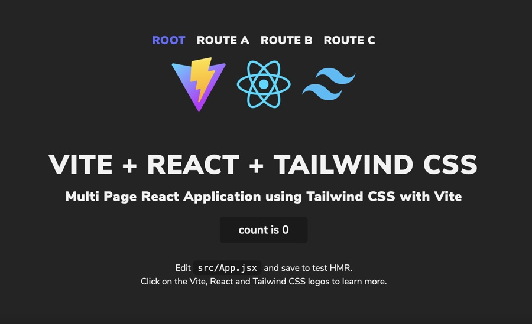

# Vite React Tailwind Prettier MPA Template

<p align="center">
    
    
    
    <br>
    <br>
</p>

This template has been configured with all of the tools required to create a Multi Page React Application using TailwindCSS with Vite.

## Screenshot

<p align="center">
    
    <br>
    <br>
</p>

## Technologies


- [React](https://reactjs.org/)
- [TailwindCSS](https://tailwindcss.com/) for utility CSS classes
- [ESLint](https://eslint.org/) configured with some initial rules
- [Prettier](https://prettier.io/) to enforce consistent code style
- [Vite](https://vitejs.dev/) to build the project for development or production

## Development

### Setup

1. `git clone https://github.com/CharlesInteractive/vite-react-tailwind-prettier-mpa-template.git`
2. Run `npm install` to install all of the project's dependencies
3. Run the local development server: `npm run dev`
4. Build the project for production: `npm run build`

### Dev Loop

- `lint` - run the linter
- `dev` - run the local development server
- `build` - build the project files for distribution
- `preview` - preview the build locally

### Multi Page Application

Example pages have been added. To add your own, create the necessary folder inside `/src` and at it to your `vite.config.js`.

```
build: {
  outDir,
  emptyOutDir: true,
  rollupOptions: {
    input: {
      main: resolve(root, "index.html"),
      routea: resolve(root, "routea", "index.html"),
      routeb: resolve(root, "routeb", "index.html"),
      routec: resolve(root, "routec", "index.html"),
    },
  },
},
```

### Tailwind CSS

The default project is styled with preconfigured Tailwind directives and layers. Learn more about Tailwind CSS [here](https://tailwindcss.com/).

A font pack is also included (Nunito Sans) along with its [Open Font License](./src/public/fonts/Nunito_Sans/OFL.txt).

## Contributing

Feel free to [open an issue](https://github.com/CharlesInteractive/vite-react-tailwind-prettier-mpa-template/issues/new) or create a PR if you'd like to contribute.

## License

The project is available as open source under the terms of the [MIT License](LICENSE).
