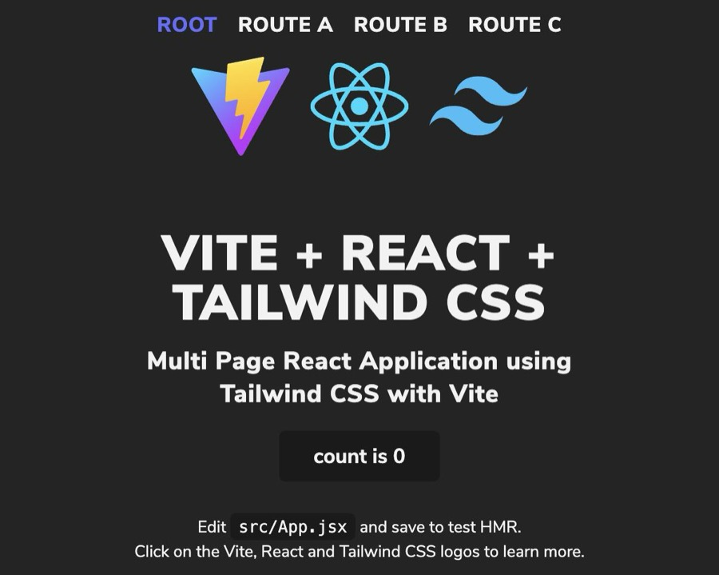

# Vite React Tailwind Prettier MPA Template

<p align="center">
    <a href="https://github.com/CharlesInteractive/vite-react-tailwind-prettier-mpa-template/actions/workflows/ci.yml">
        
    </a>
</p>

<p align="center">
    
    
    
    <br>
    <br>
</p>

This template has been configured with all of the tools required to create a Multi Page React Application using TailwindCSS with Vite.

Each "page"/route is a fully independent HTML entry point with its own React root — there
is no client-side router. Navigation between pages is plain `<a href>` links that trigger
full page loads.

## Screenshot

<p align="center">
    
    <br>
    <br>
</p>

## Technologies


- [React](https://reactjs.org/) 19
- [TailwindCSS](https://tailwindcss.com/) v4 for utility CSS classes (via `@tailwindcss/postcss`)
- [ESLint](https://eslint.org/) 9 (flat config) configured with some initial rules
- [Prettier](https://prettier.io/) 3 to enforce consistent code style (auto-sorts Tailwind classes)
- [Vite](https://vitejs.dev/) 8 to build the project for development or production

## Development

### Setup

1. `git clone https://github.com/CharlesInteractive/vite-react-tailwind-prettier-mpa-template.git`
2. Use the Node version pinned in `.nvmrc` (`v22`), e.g. `nvm use`
3. Run `npm install` to install all of the project's dependencies
4. Run the local development server: `npm run dev`
5. Build the project for production: `npm run build`

### Dev Loop

- `dev` - run the local development server (HMR)
- `build` - build the project files for distribution (to `dist/`)
- `lint` - run ESLint (uses `--max-warnings 0`, so warnings fail the run)
- `test` - run the test suite once (Vitest)
- `test:watch` - run the tests in watch mode
- `format` - format the codebase with Prettier
- `preview` - preview the production build locally

### Testing

Tests run on [Vitest](https://vitest.dev/) with
[Testing Library](https://testing-library.com/) in a `jsdom` environment. Run them with
`npm test` (or `npm run test:watch`). What's covered:

- **`src/components/Header.test.jsx`** - the active-link logic (`window.location`
  drives which nav link is highlighted, since there is no router).
- **`src/reloadOnChunkError.test.js`** - the stale-deploy safety net reloads once and is
  guarded against reload loops.
- **`tests/routes.test.js`** - the "add a page = update three places" invariant: every
  `vite.config.js` entry has its folder, and `navLinks` stays in sync with the routes.

CI (`.github/workflows/ci.yml`) runs `lint`, `test`, and `build` on every push and pull
request, using the Node version from `.nvmrc`.

### Multi Page Application

Source lives in `src/` (Vite's `root` is set to `src/`). Example pages `routea`, `routeb`,
and `routec` are self-contained and meant to be copied, edited, or deleted. Each page is a
folder with its own `index.html` + `main.jsx` + `App.jsx`.

To add your own page, update **three** places:

1. Create `src/<name>/` with `index.html`, `main.jsx`, `App.jsx` (copy an existing route).
2. Register the entry in `vite.config.js` under `build.rollupOptions.input`.
3. Add a nav link to the `navLinks` array in `src/components/navLinks.js`.

```
build: {
  outDir,
  emptyOutDir: true,
  rollupOptions: {
    input: {
      main: resolve(root, "index.html"),
      routea: resolve(root, "routea", "index.html"),
      routeb: resolve(root, "routeb", "index.html"),
      routec: resolve(root, "routec", "index.html"),
    },
  },
},
```

### Tailwind CSS

The default project is styled with preconfigured Tailwind directives and layers. Learn more about Tailwind CSS [here](https://tailwindcss.com/).

A font pack is also included (Nunito Sans) along with its [Open Font License](./src/public/fonts/Nunito_Sans/OFL.txt).

## Deployment

Assets are emitted with content-hashed filenames, so old chunks disappear on each deploy.
To avoid the "white screen after deploy" problem (a stale, cached `index.html` requesting
chunk hashes that no longer exist):

- Serve the HTML entries with `Cache-Control: no-cache` (hashed assets under `dist/assets/`
  can be cached long-term). Configure this at your host/CDN.
- `src/reloadOnChunkError.js` (imported first by every entry) is a client-side safety net
  that does a one-time reload if a stale chunk fails to load after a deploy.

See [`CLAUDE.md`](./CLAUDE.md) for the full details.

## Contributing

Feel free to [open an issue](https://github.com/CharlesInteractive/vite-react-tailwind-prettier-mpa-template/issues/new) or create a PR if you'd like to contribute.

## License

The project is available as open source under the terms of the [MIT License](LICENSE).
